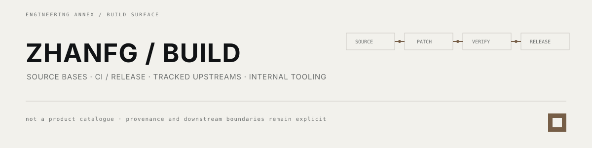

**ZhanfgBuild is an engineering annex, not a product portfolio.** It holds history-sensitive source trees, build/release plumbing, tracked upstreams and supporting repositories used by work published elsewhere.

## 01 / repository roles

| Class | What belongs here |
| --- | --- |
| <code>source-base</code> | kernel / ROM / device / vendor / framework trees where branch intent and history matter |
| <code>upstream-fork</code> | external projects retained for tracking or downstream patches; attribution remains upstream-first |
| <code>infra</code> | organization control, deployment, build, release and content infrastructure |
| <code>prototype</code> | engineering experiments that do not imply product stability |
| <code>internal</code> | private builders, patches and supporting implementation surfaces |

The machine-readable classification remains [repo-map.json](../repo-map.json); repository-local documentation remains authoritative for project-specific behavior.

## 02 / active public lines

<table>
<tr>
<td width="50%" valign="top">
SM8750 / ONEPLUS 13 
<strong><a href="https://github.com/ZhanfgBuild/android_kernel_common_oneplus_sm8750">android_kernel_common_oneplus_sm8750</a></strong> 
A full Android common-kernel source tree with dedicated upstream-sync, conflict-export and resolution-verification workflows. It is a source base, not a standalone flashable product.
</td>
<td width="50%" valign="top">
SDM845 / ONEPLUS 6 
<strong>device + kernel + vendor source family</strong> 
Branch-sensitive device, hardware, kernel and vendor repositories support current OnePlus 6 / Android source work. These repositories are kept separate because their histories and consumers are separate.
</td>
</tr>
<tr>
<td width="50%" valign="top">
ANDROID PLATFORM 
<strong>framework / Settings / Evolver / manifest sources</strong> 
Platform source bases are maintained as build inputs rather than advertised as independent applications.
</td>
<td width="50%" valign="top">
TRACKED UPSTREAMS 
<strong>KernelSU · ReSukiSU · sing-box · dae · JamesDSP · rqlite · esp-idf · …</strong> 
Mirrors and maintained forks keep their upstream identity. Local deltas should stay reviewable and reversible.
</td>
</tr>
</table>

## 03 / operating boundary

- preserve Git history, license and upstream provenance;
- prefer reviewable downstream deltas over opaque source replacement;
- keep build evidence separate from runtime/device evidence;
- keep credentials, signing material, private device data and restricted payloads out of public repositories.

<a href="https://github.com/Zhanfg">main project surface</a> · <a href="https://axymorrsen.cc">axymorrsen.cc</a>

